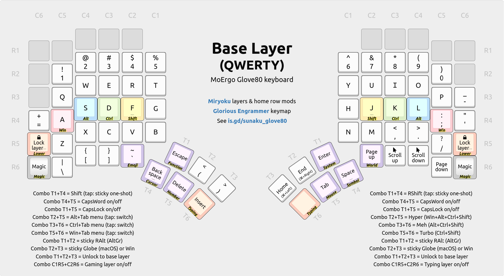

# Swedish QWERTY modified version of the "Glorious Engrammer" keymap for MoErgo Glove80

This is my Glove80 keymap forked from the awesome @sunaku work v42 RC.

See [Sunaku's original Githubpage](https://github.com/sunaku/glove80-keymaps) for details about the keybindings and other key information.
A huge thank you for his work and please support him if you like his work. Kept his original licence information below.

See [my keymap at MoErgo keymap editor here](https://my.glove80.com/#/layout/user/eeb42d70-bbbd-400f-bf03-92ef7d1ff78)

## Noteworthy changes
- Added Swedish characters åäöÅÄÖ tp the base layer (QWERTY)

## Todo
- Not all keys are correctly mapped yet to swedish counterparts in all layers but the most important ones are done.
- Smarter mappings in code to make it easier to adopt new versions from the original repo.

## Discussion

Join the [`#glorious-engrammer`][ch] channel on [MoErgo's discord server][sv].

[ch]: https://discord.com/channels/877392805654306816/1111469812850380831
[sv]: https://www.moergo.com/discord

## Original License

[Spare A Life]: https://sunaku.github.io/vegan-for-life.html
> Like sunak's work? 👍 Please [spare a life] today as thanks! 🐄🐖🐑🐔🐣🐟✨🙊✌  
> Why? For 💕 ethics, the 🌎 environment, and 💪 health; see link above. 🙇

(the ISC license)

Copyright 2023 Suraj N. Kurapati <https://github.com/sunaku>

Permission to use, copy, modify, and/or distribute this software for any
purpose with or without fee is hereby granted, provided that the above
copyright notice and this permission notice appear in all copies.

THE SOFTWARE IS PROVIDED "AS IS" AND THE AUTHOR DISCLAIMS ALL WARRANTIES
WITH REGARD TO THIS SOFTWARE INCLUDING ALL IMPLIED WARRANTIES OF
MERCHANTABILITY AND FITNESS. IN NO EVENT SHALL THE AUTHOR BE LIABLE FOR
ANY SPECIAL, DIRECT, INDIRECT, OR CONSEQUENTIAL DAMAGES OR ANY DAMAGES
WHATSOEVER RESULTING FROM LOSS OF USE, DATA OR PROFITS, WHETHER IN AN
ACTION OF CONTRACT, NEGLIGENCE OR OTHER TORTIOUS ACTION, ARISING OUT OF
OR IN CONNECTION WITH THE USE OR PERFORMANCE OF THIS SOFTWARE.
